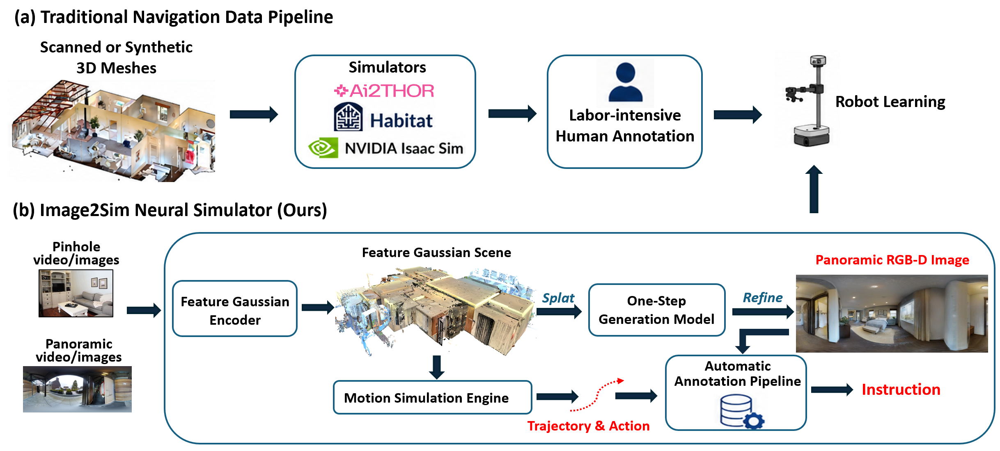

# Image2Sim: Scaling Embodied Navigation via Generative Neural Simulator

<p align="center">
  <a href="https://arxiv.org/abs/2607.05765">Paper</a> |
  <a href="https://github.com/MrZihan/Image2Sim">Code</a> |
  <a href="https://huggingface.co/datasets/MrZihanWang/Image2Sim-V1/tree/main">Data & Checkpoints</a> |
  <a href="#citation">Citation</a> |
  <a href="#license">License</a>
</p>

**Authors:** Zihan Wang, Seungjun Lee, Yinghao Xu, Gim Hee Lee 

## Overview

<p align="center">
  
</p>

Embodied navigation requires agents to interpret multimodal goals, reason over 3D space, and reliably move to the target in the real world. A major bottleneck is the lack of scalable, high-fidelity, and interactive 3D environments that can support large-scale training while preserving realistic visual observations and physical motion.

**Image2Sim** is a real-time neural simulation framework that builds interactive embodied navigation environments from posed RGB-D image sequences. The core idea is to decouple **3D spatial anchoring** from **photorealistic observation synthesis**: the simulator maintains an explicit 3D feature-Gaussian scene representation for geometry-aware navigation and uses a neural renderer with pixel-flow refinement to synthesize high-quality panoramic RGB-D observations.

Image2Sim is designed to support three main workflows:

1. **Neural scene simulation** reconstructed from pinhole/panoramic images or videos.
2. **Automated navigation data generation** with realistic visual observations, executable navigation actions and diverse language instructions.
3. **Navigation model training** with large-scale imitation learning and online DAgger.

<table>
  <tr>
    <td width="50%" align="center">
      <video src="https://github.com/user-attachments/assets/b187b1df-67a6-4b6e-8986-d4260b74fcd5"
             autoplay muted loop playsinline controls width="100%">
      </video>
      <br>
      <b>Comparison between Gaussian Splatting and Pixel Flow rendering in a high-noise sparse scene.</b>
    </td>
    <td width="50%" align="center">
      <video src="https://github.com/user-attachments/assets/18f789e5-8a48-4b74-82b0-546266c36817"
             autoplay muted loop playsinline controls width="100%">
      </video>
      <br>
      <b>Visualization of motion simulation and RGB-D rendering.</b>
    </td>
  </tr>
</table>

## Table of Contents

- [Overview](#overview)
- [Installation](#installation)
- [Data and Checkpoints](#data-and-checkpoints)
- [Quick Start with Interactive Demo](#quick-start-with-interactive-demo)
- [Training and Evaluation](#training-and-evaluation)
- [Data Process Tools](#data-process-tools)
- [Importing Custom Image or Video Data into Image2Sim](#importing-custom-image-or-video-data-into-image2sim)
- [Navigation Evaluation in Habitat](#navigation-evaluation-in-habitat)
- [Expected Directory Structure](#expected-directory-structure)
- [Citation](#citation)
- [License](#license)

## Installation

### 1. Requirements

Before installing Image2Sim, make sure your system has:

- A CUDA-enabled GPU.
- CUDA Toolkit with a working `nvcc` compiler.
- PyTorch installed with the CUDA version matching your local environment.

You can verify the CUDA compiler with:

```bash
nvcc --version
```

### 2. Clone the repository

```bash
git clone https://github.com/MrZihan/Image2Sim.git
cd Image2Sim
```

### 3. Install the panoramic feature Gaussian splatting renderer

Image2Sim uses a modified [feature Gaussian splatting rasterizer](https://github.com/ShijieZhou-UCLA/feature-3dgs) for panoramic rendering and training.

```bash
cd diff-gaussian-pano-rasterization-feature
pip install .
cd ..
```

### 4. Install `torch_kdtree`

`torch_kdtree` is used for efficient point-cloud and voxel processing.

```bash
mkdir -p external
cd external
git clone https://github.com/thomgrand/torch_kdtree.git
cd torch_kdtree
git submodule update --init --recursive
pip install .
cd ../..
```

### 5. Install Python dependencies

```bash
pip install transformers==4.57.6
pip install open3d huggingface_hub
```

## 

## Data and Checkpoints
Hugging Face login
```text
hf auth login
```

Download the pretrained models for Image2Sim (3D feature Gaussian encoder and neural render):

```text
hf download MrZihanWang/Image2Sim-V1 --include "pretrained_models/*" --repo-type dataset --local-dir ./
```
Download the checkpoints for Image2Nav (Embodied Navigation):

```text
hf download MrZihanWang/Image2Sim-V1 --include "checkpoint_pinhole_336x336_fov90/*" --repo-type dataset --local-dir ./  # Pinhole camera with 336x336 and 90° HFOV
```

Download the Image2Sim Datasets:

```text
hf download MrZihanWang/Image2Sim-V1 --include "data/*" --repo-type dataset --local-dir ./
```

After downloading the dataset, unzip all `.zip` files in the corresponding directories.

### Qwen3-VL models

Image2Sim uses Qwen3-VL models for navigation model initialization and instruction generation.

```bash
hf auth login

# For Image2Nav initialization
hf download Qwen/Qwen3-VL-4B-Instruct \
  --local-dir pretrained_models/models--Qwen--Qwen3-VL-4B-Instruct

# For instruction generation
hf download Qwen/Qwen3-VL-32B-Instruct \
  --local-dir pretrained_models/models--Qwen--Qwen3-VL-32B-Instruct
```

### Other third-party scene datasets

Download third-party scene datasets separately and place them under:

```text
data/scene_datasets/
```

| Dataset      | Usage                                             | Link                                           |
| ------------ | ------------------------------------------------- | ---------------------------------------------- |
| RealSee3D    | 10K Large-scale indoor scenes with panorama data | https://github.com/realsee-developer/RealSee3D |
| Structured3D | 3.5K Synthetic structured indoor scenes                | https://github.com/bertjiazheng/Structured3D   |
| ARKitScenes  | Optional, 4K+ room-level scene           | https://github.com/apple/ARKitScenes           |

Make sure all dataset paths are correctly configured in:

```text
scripts/dataset_config.json
```

## Quick Start with Interactive Demo

The minimal Image2Sim simulator interface requires the following files or directories to be available in your project path:

```text
dinov3/
image2sim.py
data_tools.py
pretrained_models/
scripts/dataset_config.json
```

The example shows how to initialize the simulator, build feature Gaussians for one scene, import navigable voxels, render observations, and control the agent.
Make sure your machine has a display available, or that your terminal session supports X11 forwarding for graphical visualization.

```python
import glob
import json
import os
from types import SimpleNamespace
import open3d as o3d
import torch
import data_tools
import image2sim
import cv2
import numpy as np
from image2sim import Action
from torch.cuda.amp import autocast
# -----------------------------------------------------------------------------
# 1. Initialize Image2Sim
# -----------------------------------------------------------------------------

device = "cuda:0"
config = SimpleNamespace(
    image_height=512,
    batch_size=1,
    max_depth=10.0,
    device=device,
)

neural_simulator = image2sim.NeuralSimulator(config)

# Load pretrained Gaussian and pixel-flow models.
neural_simulator = data_tools.load_checkpoint(neural_simulator, "pretrained_models")

# Optional: compile neural simulator for faster inference.
neural_simulator.torch_compile()

# Inference mode.
neural_simulator.eval()

# -----------------------------------------------------------------------------
# 2. Load dataset configuration
# -----------------------------------------------------------------------------

with open("scripts/dataset_config.json", "r") as f:
    data_source = json.load(f)

# One scene of HM3D is used here as an example.
dataset_info = data_source["hm3d"]
dataset_type = dataset_info['dataset_type']
images_dir = dataset_info['images_dir']
scenes_dir = dataset_info['scenes_dir']

# Enumerate all scenes with navigable voxel maps.
pcd_files = glob.glob(os.path.join(scenes_dir, "*_navigable.pcd"))
scene_names = [os.path.basename(f).replace("_navigable.pcd", "") for f in pcd_files]
scene_names.sort()

scene_name = scene_names[0]
scene_path = os.path.join(images_dir, scene_name)
full_pcd_path = os.path.join(scenes_dir, f"{scene_name}.pcd")
nav_pcd_path = os.path.join(scenes_dir, f"{scene_name}_navigable.pcd")

# Optional: denoised structure point cloud.
scene_pcd = None
# scene_pcd = o3d.io.read_point_cloud(full_pcd_path)

# Navigable voxels for motion simulation.
nav_pcd = o3d.io.read_point_cloud(nav_pcd_path)

# -----------------------------------------------------------------------------
# 3. Build and import full-scene feature Gaussians
# -----------------------------------------------------------------------------

with torch.amp.autocast(device_type='cuda'):
  with torch.no_grad():
    scene_xyz, scene_rgb, scene_feats, scene_gs, all_frames_data = data_tools.build_scene_pointcloud_data(
        scene_path,
        dataset_type=dataset_type,
        device=device,
        voxel_size=0.005,        # Voxel downsampling size for Gaussian construction.
        model=neural_simulator,
        max_batch_size=1000,     # Maximum number of images used to construct the scene.
        inpaint_depth=True,      # Pre-complete missing depth inputs.
    )
    
    neural_simulator.import_scene_gaussian(
        xyz=scene_xyz,
        rgb=scene_rgb,
        feats=scene_feats,
        gs_attrs=scene_gs,
    )
    
    # Load navigable voxels and the optional structural point cloud for denoising.
    neural_simulator.load_navigable_pcd(nav_pcd, scene_pcd)

# Select a start position 
nav_points = np.asarray(nav_pcd.points)
center = nav_points.mean(axis=0)
start = nav_points[np.argmin(np.linalg.norm(nav_points - center, axis=1))]

start_pos = torch.tensor(
    start, device=device, dtype=torch.float32
).view(1, 3)

start_heading = torch.rand(
    1, device=device, dtype=torch.float32
) * 2 * np.pi
neural_simulator.reset_agents(start_pos, start_heading)

# -----------------------------------------------------------------------------
# 4. Interactive panorama RGB-D demo
# -----------------------------------------------------------------------------

def render():
    return neural_simulator.get_panorama_observation(
        neural_simulator.agent_pos,
        neural_simulator.agent_heading
    )

def vis(rgb, depth, scale=1.0):
    rgb = rgb[0].detach().cpu().numpy()
    depth = depth[0].detach().cpu().numpy()
    depth = (255 * (1 - np.clip(depth / neural_simulator.max_depth, 0, 1))).astype(np.uint8)
    depth = cv2.applyColorMap(depth, cv2.COLORMAP_TURBO)
    rgb = cv2.cvtColor(rgb, cv2.COLOR_RGB2BGR)
    frame = np.vstack([rgb, depth])   # RGB top, depth bottom
    if scale != 1.0:
        h, w = frame.shape[:2]
        frame = cv2.resize(frame, (int(w * scale), int(h * scale)))

    return frame

action = {
    ord("w"): Action.MOVE_FORWARD,
    ord("a"): Action.TURN_LEFT,
    ord("d"): Action.TURN_RIGHT,
}


with torch.amp.autocast(device_type='cuda'):
  with torch.no_grad():
        print("Click the visualization window first, then use keyboard controls: W=forward, A=left, D=right, Q=quit.")
        rgb, depth = render()
        while True:
            cv2.imshow("Image2Sim Panorama: RGB | Depth", vis(rgb, depth))
            key = cv2.waitKey(10) & 0xFF

            if key == 255:
                continue
            if 65 <= key <= 90:
                key += 32
            if key == ord("q"):
                break

            if key in action:
                _, info = neural_simulator.step([action[key]], render_observation=False)
                rgb, depth = render()
                print(
                    "pos=", info["position"][0].detach().cpu().numpy(),
                    "heading=", float(info["heading"][0].detach().cpu()),
                    "collided=", bool(info["collided"][0].detach().cpu()),
        )

cv2.destroyAllWindows()
```

## Training and Evaluation

### Train the feature 3DGS encoder and neural renderer

```bash
bash scripts/3dgs_train.sh
```

### Evaluate neural rendering quality

A lightweight reference implementation is provided:

```bash
python3 3dgs_eval.py
```

### Train Image2Nav navigation model

Stage 1: behavior cloning.

```bash
bash scripts/vln_train.sh
```

Stage 2: online DAgger training.

```bash
bash scripts/vln_train_dagger.sh
```


## Data Process Tools

Image2Sim provides utilities for building simulator-ready data.

### Generate navigation data

```bash
python3 nav_data_generation.py
```

### Convert Habitat-compatible scenes into Image2Sim

```bash
python3 data_processor/get_mp3d_scene_data.py
python3 data_processor/get_hm3d_scene_data.py
python3 data_processor/get_gibson_scene_data.py
```

### Convert image or video datasets into Image2Sim

```bash
python3 data_processor/get_image_video_scene_data.py
```

### Convert VLN annotations from habitat into Image2Sim

```bash
python3 data_processor/convert_vln_from_habitat_to_image2sim.py
```

### Convert data from D3D-VLP into Image2Sim

Some [D3D-VLP](https://arxiv.org/abs/2512.12622) data can also be converted into the Image2Sim simulator format. 

```bash
python3 data_processor/convert_d3d_vlp_to_image2sim.py
```

## Importing Custom Image or Video Data into Image2Sim

Image2Sim can be used with third-party multi-view image or video data.

Recommended preprocessing workflow:

1. Use external 3D reconstruction or geometry-estimation tools, such as [VGGT Omega](https://github.com/facebookresearch/vggt-omega), [Lingbot-Map](https://github.com/robbyant/lingbot-map) or [Argus](https://github.com/realsee-developer/Argus) to estimate depth maps, camera poses, and intrinsics for pinhole or panoramic images.
2. Convert the data into a format compatible with `data_tools.py`, following existing scene formats such as `hm3d_360` or `ScanNet`.
3. Place converted scene data under:

```text
data/scene_datasets/
```

4. Run the image/video scene processor to build scene geometry:

```bash
python3 data_processor/get_image_video_scene_data.py
```

5. Store generated navigation maps under:

```text
data/nav_map/
```

External 3D reconstruction systems are not integrated into this repository because of license constraints and engineering complexity.


## Navigation Evaluation in Habitat

Image2Sim-trained navigation models can be evaluated in the Habitat simulator for cross-simulator evaluation.

### Install Habitat

```bash
conda create -n habitat python=3.9 cmake=3.14.0 -y
conda activate habitat
conda install habitat-sim=0.3.3 withbullet headless -c conda-forge -c aihabitat

git clone --branch v0.3.3 https://github.com/facebookresearch/habitat-lab.git
cd habitat-lab
pip install -e habitat-lab
pip install -e habitat-baselines
```

### Download Habitat evaluation data

Place evaluation data under:

```text
data/datasets/
data/scene_datasets/
```

| Data        | Target path                 | Link                                                                                                                  |
| ----------- | --------------------------- | --------------------------------------------------------------------------------------------------------------------- |
| MP3D scenes | `data/scene_datasets/mp3d/` | [Official Matterport3D project page](https://niessner.github.io/Matterport)                                           |
| R2R-CE      | `data/datasets/r2r/`        | [r2r-ce](https://drive.google.com/file/d/1T9SjqZWyR2PCLSXYkFckfDeIs6Un0Rjm/view), rename `R2R_VLNCE_v1-3` to `r2r`    |
| RxR-CE      | `data/datasets/rxr/`        | [rxr-ce](https://drive.google.com/file/d/145xzLjxBaNTbVgBfQ8e9EsBAV8W-SM0t/view), rename `RxR_VLNCE_v0` to `rxr`      |
| REVERIE-CE  | `data/datasets/reverie/`    | [reverie-ce]( https://huggingface.co/datasets/MrZihanWang/Image2Sim-V1/tree/main/data/datasets), extract to `reverie` |

### Evaluate Navigation Performance

Use different config file at `vln/config` to evaluate on different datasets

```bash
bash scripts/vln_eval.sh
```


## Expected Directory Structure

A typical Image2Sim working directory should look like this:

```text
Image2Sim/
├── pretrained_models/
│   │── image2sim_iter_xxxxx.pth # Pre-trained model for pixelflow render
│   ├── models--Qwen--Qwen3-VL-4B-Instruct/
│   ├── models--Qwen--Qwen3-VL-32B-Instruct/
│   └── * # Other pre-trained weights
├── data/
│   ├── scene_datasets/ # RGBD data for scene reconstruction
│   ├── nav_map/  # Scene geometry map
│   ├── nav_data/ # Navigation training data
│   └── datasets/ # optional, dataset for Habitat navigation evaluation
├── data_processor/
├── diff-gaussian-pano-rasterization-feature/
├── dinov3/
├── habitat_extensions/ # optional, some tools for Habitat navigation evaluation
├── vln/ # Navigation model, training and evaluation code
├── scripts/
│   ├── dataset_config.json
│   ├── 3dgs_train.sh
│   ├── vln_train.sh
│   ├── vln_train_dagger.sh
│   └── vln_eval.sh
├── data_tools.py
├── image2sim.py
├── nav_data_generation.py
└── 3dgs_train.py
└── 3dgs_eval.py
```


## Citation

If you find Image2Sim useful for your research, please cite the project:

```bibtex
@article{wang2026image2sim,
  title={Image2Sim: Scaling Embodied Navigation via Generative Neural Simulator},
  author={Wang, Zihan and Lee, Seungjun and Xu, Yinghao and Lee, Gim Hee},
  journal={arXiv preprint arXiv:2607.05765},
  year={2026}
}
```

## License

Image2Sim uses a layered license:

- **Source code:** Apache License 2.0.
- **Generated data and non-code research artifacts:** Creative Commons Attribution-NonCommercial 4.0 International License (CC BY-NC 4.0), unless otherwise specified.
- **Third-party-derived data and models:** subject to the original dataset, model, and software licenses, terms of use, and access restrictions.

Users must separately obtain access to any required third-party datasets, pretrained models, and external software, and must comply with their original terms. This repository does not grant additional rights to third-party assets, scans, images, meshes, panoramas, semantic annotations, pretrained models, or other external materials.

For full details, see:

- [`LICENSE`](https://github.com/MrZihan/Image2Sim/blob/main/LICENSE)
- [`LICENSE_NOTICE.MD`](https://github.com/MrZihan/Image2Sim/blob/main/LICENSE_NOTICE.MD)

Copyright 2026 National University of Singapore (NUS).
